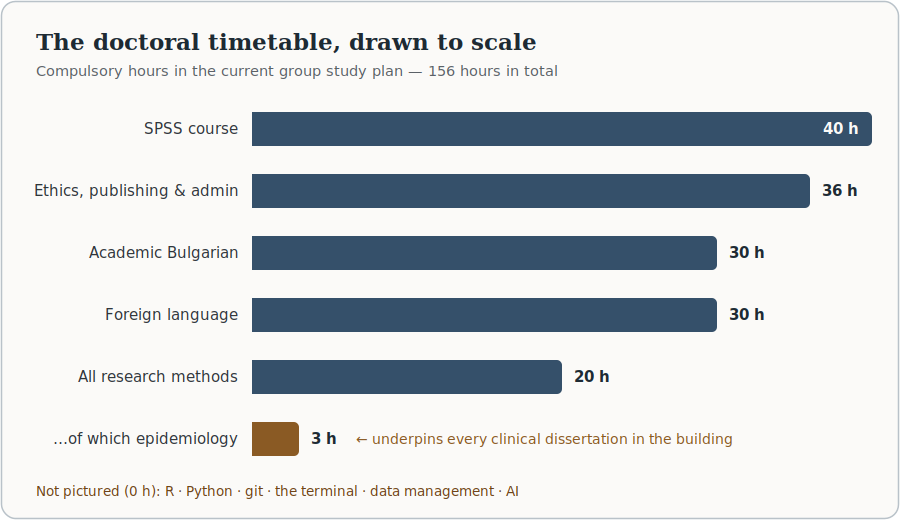
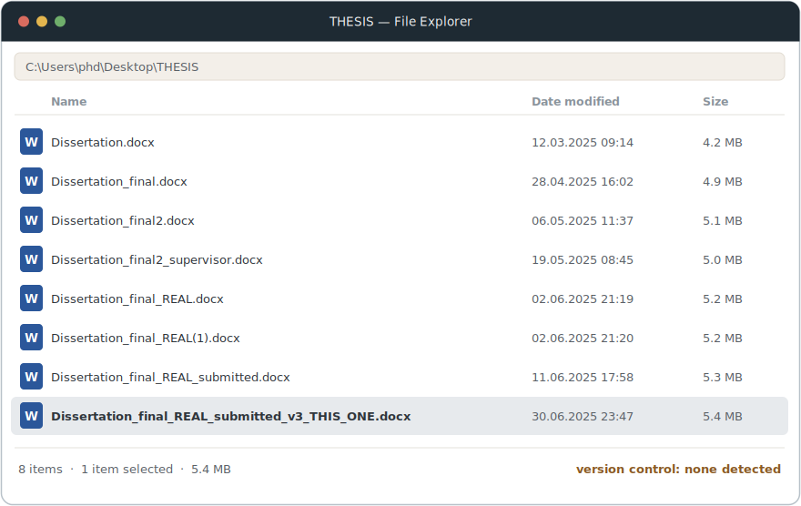
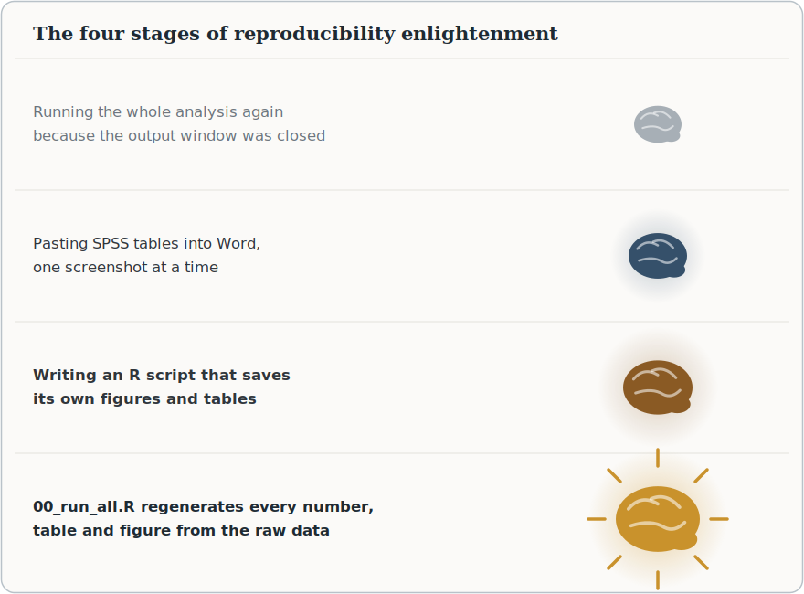

In the [previous post](academic-writing-setup.qmd) I argued that academic writing has already changed — that producing clean prose is no longer the bottleneck, and that the value has moved into design, analysis, reproducibility and judgement. This post is the natural sequel, and the less comfortable one: if research has changed, what about the way we train researchers?

Let me start where I intend to finish, because this is not a hostile post. Our doctoral school is run by people I know and respect. The programme covers real and necessary ground — research ethics, publication practice, study methodology, academic language — taught by colleagues who show up and care. Several of its lectures are on exactly the right topics: there is a session on causal modelling, one on qualitative methods, one on survey design, and — genuinely ahead of many programmes — one on the principles of transparent and reproducible scientific data. The foundations are not wrong.

The proportions are. Research practice has transformed more in the last five years than in the previous twenty-five, and the curriculum has, as far as I can tell, transformed hardly at all. I recently sat down with the current group study plan and a calculator, and this post is what the calculator said.

::: {.callout-note}
## The short version

The doctoral curriculum spends 40 hours teaching one statistics package, 60 hours teaching languages, and 3 hours teaching epidemiology. It contains no R, no Python, no version control, no terminal, no data management, and no mention of artificial intelligence — the single largest change to research practice in a generation. None of the existing content needs to be abolished. It needs to be *rebalanced*, and the curriculum's own facultative track already provides the mechanism.
:::

## 1. The curriculum, by the numbers

The plan totals 156 compulsory hours, of which a doctoral student needs 120 hours and 30 points to be admitted to defence. Here is how those hours are distributed:

| Block                                                                                                                    | Hours |         Share |
|:-------------------------------------------------------------------------------------------------------------------------|------:|--------------:|
| SPSS course                                                                                                              |    40 |          26 % |
| Bulgarian for academic purposes                                                                                          |    30 |          19 % |
| Foreign language (English, German or French)                                                                             |    30 |          19 % |
| All research-methods lectures combined — epidemiology, statistics, systematic reviews, causal modelling, reproducible data, qualitative methods, surveys, experimental methods |    20 |          13 % |
| Everything else — ethics, publishing, pedagogy, administration, funding, law, and assorted topics                        |    36 |          23 % |
| *of which: epidemiology, specifically*                                                                                   |   *3* |         *2 %* |

: The compulsory doctoral-school timetable, grouped. Software and language instruction together account for 100 of 156 hours — just under two-thirds of the programme.

The points arithmetic is even more striking than the hours. The SPSS course carries 10 points; the two language courses carry 7.5 each. A doctoral student can therefore earn 25 of the 30 points required for admission to defence — 83 per cent — from software clicking and grammar, without encountering a single research method.

{fig-alt="Horizontal bar chart of compulsory doctoral-school hours: SPSS 40, ethics/publishing/administration 36, academic Bulgarian 30, foreign language 30, all research-methods lectures 20, of which epidemiology 3, drawn in bronze. A footnote lists what receives zero hours: R, Python, git, the terminal, data management, and AI."}

And within the remaining lecture programme, the allocation has a certain accidental poetry. Causal inference and phytotherapy receive equal time. So do chromatographic methods and the principles of reproducible science. Epidemiology — the discipline that underpins essentially every clinical dissertation the university produces — receives one lecture: three hours, two per cent of the timetable.

::: {.callout-important}
## What this post is not

It is not an argument that any current lecture is worthless, and it is emphatically not a criticism of the lecturers, some of whom are working well ahead of the structure they teach within. Every topic in the plan is defensible on its own. The argument is about *allocation*: what occupies two-thirds of the timetable versus what occupies none of it. Curricula are budgets, and budgets reveal priorities whether or not anyone intended them to.
:::

## 2. The typewriter problem

Imagine a modern course on transportation that opens with a full semester on the care and maintenance of the horse-drawn carriage. Nobody would defend it by pointing out that carriages genuinely existed and genuinely worked — both true — because the objection was never that carriages are *wrong*. The objection is that they no longer deserve the first semester.

Teaching only SPSS to a doctoral student in 2026 is drifting into the same territory: teaching the mechanical typewriter, thoroughly and with genuine expertise, to someone who will spend their career at a laptop. SPSS is not wrong. Menu-driven analysis produced decades of legitimate science, and knowing it still has value — the same way knowing how to read a paper map still has value. But we now teach it as though GPS had not been invented, and the timetable is the tell: forty hours for the software, four for the statistical reasoning it is supposed to serve. We spend ten times longer teaching where to click than teaching what the clicking means.

The same pattern repeats in literature searching. Students learn Boolean operators in careful detail — `AND`, `OR`, the placement of brackets, field tags — and this is *still genuinely necessary*, because a systematic review requires a reproducible search string and PRISMA will ask for it. But it is taught as the whole of the skill, in a world where AI tools draft a competent search strategy in seconds and [machine-learning screeners](https://doi.org/10.1038/s42256-020-00287-7) can triage a thousand abstracts before lunch. The scarce skill has moved: it is no longer constructing the query but *verifying* what comes back. We teach the 1995 half of the workflow and are silent about the 2026 half.

Meanwhile many of our students can produce a `.sav` file but not a reusable research project. They learn where to click, but not how a research pipeline fits together. That is the gap this post is about.

## 3. What is missing

Six things, in the order I would teach them. Each comes with a hands-on taste of what the teaching would look like, because the argument for these tools is best made by showing how small they are.

### 3.1 Plain text: Markdown, Pandoc, Quarto

The single highest-leverage change to a research-writing workflow is also the simplest: write in plain text. [Markdown](https://www.markdownguide.org/) takes roughly fifteen minutes to learn in its entirety:

````markdown
## Results

A total of **1,284 patients** were included. Median age was 62 years
(IQR 54–71); 47 % were female.

- Crude mortality: 8.2 %
- Adjusted OR for the exposed group: 1.94 (95 % CI 1.31–2.87)

As shown in @fig-survival, the curves separate after day 10.
The effect is consistent with earlier reports [@petrov2024sepsis].
````

That is the entire skill. And yet it unlocks the whole modern publishing chain: [Pandoc](https://pandoc.org) converts it to anything, and [Quarto](https://quarto.org) turns it into a complete academic manuscript system — numbered figures and tables, cross-references, and citations pulled automatically from a [BibTeX](https://www.bibtex.org/) file managed with [Zotero](https://www.zotero.org) and [Better BibTeX](https://retorque.re/zotero-better-bibtex/). A minimal manuscript header:

```yaml
---
title: "Antibiotic prescribing in Bulgarian primary care, 2019–2025"
author: "K. Kostadinov"
bibliography: references.bib
csl: vancouver.csl
---
```

And then one file renders to every format anyone will ever demand of you:

```bash
quarto render paper.qmd --to pdf    # for the preprint
quarto render paper.qmd --to html   # for the website
quarto render paper.qmd --to docx   # for the co-author who insists
```

Change the journal, change one `csl:` line, and every citation reformats itself. Students still learn Boolean operators in detail, yet many have never written a Markdown document — and of the two skills, this is the one they will use every working day for the rest of their careers.

### 3.2 The terminal

The command line looks like the *most* old-fashioned item on this list, which is the joke hiding inside the whole argument: the "typewriter" here is the point-and-click interface, and the terminal is the modern tool. It is the highest-ROI computing skill a researcher can acquire, because it turns entire categories of tedious manual work into single lines:

```bash
# Which of these 300 exported files actually contains the variable "egn"?
grep -l "egn" exports/*.csv

# How many records are in each district's export?
wc -l data/districts/*.csv

# Convert every SPSS file in a folder to CSV — the bridge out of .sav world
for f in *.sav; do
  Rscript -e "haven::read_sav('$f') |> readr::write_csv('${f%.sav}.csv')"
done
```

Each of those replaces an afternoon of opening files one by one. A two-hour introduction — navigation, wildcards, loops, `grep`, and the discipline of doing things in a way that can be repeated — pays for itself within the month. It is also the doorway to everything else on this list: git lives there, Quarto renders there, and every server the student will ever touch speaks nothing else.

### 3.3 Version control

Every research group has seen this folder, and most have produced it:

{fig-alt="A mock file-explorer window titled THESIS showing eight files: Dissertation.docx, Dissertation_final.docx, Dissertation_final2.docx, Dissertation_final2_supervisor.docx, Dissertation_final_REAL.docx, Dissertation_final_REAL(1).docx, Dissertation_final_REAL_submitted.docx and Dissertation_final_REAL_submitted_v3_THIS_ONE.docx, the last one saved at 23:47. The status bar reads: version control: none detected."}

This is version control, implemented badly, by hand, under stress. [Git](https://git-scm.com) is the same instinct implemented properly, and the working core of it is four commands:

```bash
git init
git add analysis.R manuscript.qmd
git commit -m "Add baseline model: unadjusted OR 2.1 (1.5-2.9)"

# six months later, when a reviewer asks what changed and why:
git log --oneline
```

As I argued in the previous post, git's value in research is not really collaboration — it is a *history of your reasoning*, which for a doctoral student is close to a dissertation-defence superpower: every analytical decision, dated, explained, and reversible. Add [GitHub](https://github.com) and the project survives a stolen laptop, which at least one student per cohort will discover the hard way. There is no version-control anywhere in our current 156 hours.

### 3.4 Data management

The data equivalent of the `final_REAL.docx` folder is `data_new_final2.xlsx`, and it is not funny when it happens to three years of patient records. What a doctoral student needs is a small set of unglamorous conventions — the literature politely calls them ["good enough practices"](https://doi.org/10.1371/journal.pcbi.1005510), which is exactly the right ambition for year one:

**Tidy structure.** One row per observation, one column per variable, one value per cell — no merged cells, no colour-as-information, no three tables sharing a worksheet. This is ["tidy data"](https://doi.org/10.18637/jss.v059.i10), and it is the difference between a dataset an analysis can read and a decorated screenshot.

**Open formats.** CSV outlives everything. A `.sav` file assumes the reader owns a licence for one company's product; a CSV assumes the reader owns a computer. Spreadsheets, meanwhile, edit your data when you are not looking: a systematic audit found Excel had [silently converted gene names into dates](https://doi.org/10.1186/s13059-016-1044-7) in roughly a fifth of published genomics supplements — an error class so durable that the genetics community eventually surrendered and renamed the genes. For data that outgrow spreadsheets, [SQLite](https://sqlite.org) and [DuckDB](https://duckdb.org) are free, single-file databases that a student can learn in an afternoon.

**A data dictionary.** Every dataset ships with a table describing itself — because in two years, nobody, including the author, will remember whether `sex = 1` meant male or female:

| variable  | type    | units / values                    | description                     |
|:----------|:--------|:----------------------------------|:--------------------------------|
| id        | integer | —                                 | pseudonymised patient id        |
| age       | integer | years                             | age at admission                |
| sex       | factor  | m / f                             | sex as recorded at admission    |
| bmi       | numeric | kg/m²                             | measured at admission           |
| outcome   | factor  | discharged / died / transferred   | status at 30 days               |

**Immutable raw data.** The original export is read-only, forever; every correction happens in a script that documents what was wrong.

None of this is difficult. All of it is absent from the curriculum — at the exact moment when the [FAIR principles](https://doi.org/10.1038/sdata.2016.18) have moved from aspiration to funding condition, and Horizon Europe will not sign off a grant without a data-management plan. We are not teaching the paperwork our own students' future funding requires.

### 3.5 Programming

Not to make software engineers — to cross one specific threshold: the point where writing a script becomes *easier* than doing the task by hand, because past that point reproducibility happens as a side effect of laziness. Compare the same analysis in our current curriculum and in one line of [R](https://www.r-project.org):

> *Analyze ▸ Compare Means ▸ Independent-Samples T Test ▸ drag `bmi` to Test Variables ▸ drag `sex` to Grouping Variable ▸ Define Groups… ▸ OK*

```r
t.test(bmi ~ sex, data = patients)
```

The difference is not speed, though the script wins. The difference is that one of these can be saved, shared, diffed, cited, reviewed and rerun unchanged in a year — and the other is a memory. A click path *is* an analysis; it is just an analysis that evaporates on completion. When the reviewer asks for the same model excluding one hospital, the script user changes one line; the click user starts over and hopes to click identically.

R or [Python](https://www.python.org), one of them, [taught for research rather than for computer science](https://doi.org/10.1371/journal.pbio.1001745) — data in, cleaning, model, figure, table out. Twenty hours gets a motivated student to self-sufficiency, and free curricula already exist to be borrowed from wholesale: [Software Carpentry](https://software-carpentry.org), [R for Data Science](https://r4ds.hadley.nz/), [The Turing Way](https://book.the-turing-way.org).

{fig-alt="A four-stage expanding-brain-style illustration: a small dim brain for rerunning the whole analysis because the SPSS output window was closed; a brighter brain for pasting SPSS tables into Word one screenshot at a time; a glowing brain for writing an R script that saves its own figures and tables; and a radiant brain with rays for a 00_run_all.R script that regenerates every number, table and figure from the raw data."}

### 3.6 AI literacy

The largest change in research practice in a generation appears in our doctoral curriculum exactly zero times. Not as a tool, not as a policy, not even as a warning.

The students, of course, have not waited. [Surveys of researchers](https://doi.org/10.1038/d41586-023-02980-0) already show these tools embedded across the workflow, and doctoral students are the heaviest adopters — for translation, for drafting, for literature triage, for code — unguided, undisclosed and untaught, which is precisely the worst available combination. A doctoral school cannot ban its way out of this, and silence is not neutrality; silence just outsources the teaching to TikTok. The choice is not whether doctoral students will use AI. It is whether the first serious conversation about verification and disclosure happens in a classroom or in a misconduct hearing.

What should actually be taught is not "use ChatGPT." It is a set of professional skills:

- **Prompting as specification** — describing a task precisely enough to get useful work back, which is itself excellent training in thinking clearly about the task.
- **Verification as the core discipline** — every factual claim checked, every reference resolved to a real paper *and read*, because [models fabricate citations fluently](https://doi.org/10.1038/s41598-023-41032-x) and a fabricated citation in a dissertation is a career-level event.
- **Literature work with grounded tools** — [Elicit](https://elicit.com) and [Perplexity](https://www.perplexity.ai) for citation-linked search, [NotebookLM](https://notebooklm.google.com) for interrogating a corpus of papers *you selected*, alongside — not instead of — the reproducible Boolean search the library already teaches.
- **Coding assistants** — [Claude](https://claude.ai), [ChatGPT](https://chatgpt.com), [Gemini](https://gemini.google.com) as accelerators for analysis code the student can already read, never as oracles for code they cannot.
- **Disclosure and ethics** — what [journal policies](https://doi.org/10.1038/d41586-023-00191-1) actually require, what patient data must never be pasted into a chat window, and where responsibility sits: always with the author, because [a model is a tool, not a co-author](https://doi.org/10.1126/science.adg7879).

The boundary rule I gave in the previous post applies with double force to trainees: these tools are for work you *could* do slowly, never for work you could not do at all. Teaching students to hold that line is exactly what a doctoral school is for.

### 3.7 Epidemiology and statistics, in adult doses

Finally, the two subjects the school already teaches — at homeopathic dilution.

Three hours of epidemiology, in a medical university, is not a syllabus; it is a trailer. Every clinical dissertation the institution produces is, at bottom, an exercise in epidemiological reasoning — and bias, confounding, study design, validity and the hierarchy of evidence cannot be installed in a single afternoon. These are also precisely the skills that AI makes *more* valuable, not less: a model will happily and fluently describe a confounded estimate, and only a trained reader will notice. The reporting guidelines every journal now enforces — [STROBE](https://www.strobe-statement.org/), [CONSORT](https://www.consort-statement.org/), [PRISMA](https://www.prisma-statement.org/) — are epidemiological reasoning in checklist form; students should meet them before their first submission, not during it.

Statistics has the inverse problem: the hours exist, but they are spent on the container rather than the content. Forty hours of SPSS against four hours of statistical methodology means a student learns to *run* a t-test long before, and possibly instead of, learning what one assumes. The existing two-hour session on causal modelling shows the school knows what direction to face — regression as a general tool, mixed models for the clustered data every clinical student actually has, causal thinking, uncertainty, visualisation as argument. It simply needs more than two hours to face it in.

::: {.callout-note collapse="true"}
## A starter syllabus, entirely free of charge

Everything in this section can be taught from materials that cost nothing — which will matter again in a moment:

- [The Turing Way](https://book.the-turing-way.org) — a community handbook of reproducible, ethical data science; the closest thing to a ready-made curriculum for exactly the gap described here.
- [Software Carpentry](https://software-carpentry.org) and [Data Carpentry](https://datacarpentry.org) — battle-tested two-day workshop curricula (Unix shell, git, R, Python, spreadsheets, SQL), openly licensed and designed to be taught by local instructors.
- [R for Data Science](https://r4ds.hadley.nz/) — the standard free textbook for modern R.
- [Happy Git and GitHub for the useR](https://happygitwithr.com) — version control specifically for researchers who have never seen it.
- [Quarto's Get Started guide](https://quarto.org/docs/get-started/) — from zero to a rendered manuscript in an hour.
- ["Good enough practices in scientific computing"](https://doi.org/10.1371/journal.pcbi.1005510) — the single paper I would set as required reading before a student touches their first dataset.
- The [FAIR principles](https://doi.org/10.1038/sdata.2016.18) and a [machine-learning screening framework](https://doi.org/10.1038/s42256-020-00287-7) for systematic reviews — the two papers that explain what funders and evidence synthesis now expect.
:::

## 4. A modest reallocation

Here is the constructive version of the complaint — the same 156 hours, redistributed. Nothing is abolished; the languages and SPSS survive; only the proportions move.

| Component                                             | Hours now | Hours proposed |
|:------------------------------------------------------|----------:|---------------:|
| SPSS (as one tool among several, not the default)     |        40 |             10 |
| R or Python for research                              |         0 |             24 |
| Git, reproducible workflows, project structure        |         0 |             10 |
| Data management, tidy data, documentation, FAIR       |         0 |              8 |
| AI literacy for research                              |         0 |             10 |
| Epidemiology                                          |         3 |             12 |
| Statistical reasoning beyond the basics               |         4 |             12 |
| Academic Bulgarian and foreign language               |        60 |             40 |
| Ethics, publishing, administration, everything else   |        49 |             30 |
| **Total**                                             |   **156** |        **156** |

: One possible rebalancing. The exact numbers are an opening bid, not a demand — the point is the shape: methods and computation grow from 30 % of the timetable to roughly 55 %, and no topic disappears.

The language reduction deserves one honest sentence, because 60 hours is the second-largest block in the plan: as I argued [in the previous post](academic-writing-setup.qmd), producing grammatical academic English is now the *most* automatable task in the entire research workflow. The [well-measured tax on second-language researchers](https://doi.org/10.1371/journal.pbio.3002184) — more time per paper, more rejections on language grounds — has largely been abolished. Spending a fifth of the doctoral timetable paying an abolished tax is exactly the kind of allocation that made me reach for the calculator.

## 5. The mechanism already exists

The most encouraging thing I found in the study plan is procedural. Alongside the compulsory programme, the plan provides for *facultative disciplines and guest lectures*, updated with each revision of the plan — which happens twice per academic year, with the resulting points counting on top of the compulsory minimum.

That is a pilot mechanism, already approved, already in the document. No committee needs to abolish anything, and nobody's existing course needs to shrink on day one. A single facultative module — *Modern research workflows: R, git, Quarto and AI for doctoral students*, twenty hours, hands-on, laptops open — could be proposed at the next semi-annual update. If the demand is what I think it is, the enrolment numbers will make the argument for rebalancing the compulsory core far more persuasively than this post can. If I am wrong, the experiment was cheap.

I am, for the record, volunteering.

## 6. Why this matters: the leading-institution argument

The argument that actually moves institutions is not about tools; it is about position — and it has five parts.

**The ground has already shifted, publicly.** A decade ago, [Nature surveyed 1,576 scientists](https://doi.org/10.1038/533452a) and found that most had failed to reproduce another researcher's experiment — and half had failed to reproduce their own. The response of the leading institutions was not embarrassment but infrastructure: the [manifesto for reproducible science](https://doi.org/10.1038/s41562-016-0021) that followed put *training* first on its list of remedies, ahead of incentives and ahead of policy. Reproducibility moved from a private virtue to a public criterion by which institutions are judged. A doctoral school that does not teach it is not staying neutral; it is visibly on the wrong side of a line the field has already drawn.

**The rules of the game are now written down.** [UNESCO's Recommendation on Open Science](https://unesdoc.unesco.org/ark:/48223/pf0000379949) — adopted unanimously by 193 countries, Bulgaria included — commits member states to exactly the practices this post describes. [Horizon Europe](https://research-and-innovation.ec.europa.eu/strategy/strategy-research-and-innovation/our-digital-future/open-science_en) does not merely encourage open science; it *scores* it in proposal evaluation and requires a data-management plan as a contractual deliverable. Journals increasingly require code and data availability; systematic reviews increasingly assume machine-assisted screening. [LERU, the league of Europe's research universities](https://www.leru.org/publications/open-science-and-its-role-in-universities-a-roadmap-for-cultural-change), calls the transition a "cultural change" that universities must *manage*, not await. These are the rules our students are entering the game under — and none of them are covered in the 156 hours we require. Meanwhile the doctoral schools we benchmark against, the ones aligned with [ORPHEUS standards](https://orpheus-med.org/) for biomedical PhD training, have made transferable research-skills training a criterion of programme quality, and initiatives like [the Carpentries](https://carpentries.org) have taught reproducible computing to tens of thousands of researchers worldwide. Our graduates will compete with theirs — for the same grants, the same journals, the same positions.

**Leading is cheaper than lagging.** Here is the budget line that makes this proposal unusual: there isn't one. R, Python, git, Quarto, Pandoc, SQLite, DuckDB and every item on the starter syllabus above are free, in both senses. The one statistical product we currently organise a forty-hour course around is the one that bills the university annually, per seat. A curriculum built on open tooling is not an expensive modernisation to be scheduled for some richer future year — it is a *cost reduction* with better outcomes attached. Institutions rarely get offered that trade.

**First movers collect the students.** Doctoral candidates in Bulgaria are a shrinking and increasingly mobile pool, and the strong ones choose programmes the way strong programmes choose them: by asking what they will actually learn. No Bulgarian medical university currently teaches AI-era, reproducible, computational research practice as part of its doctoral core. The first one to do it acquires something rankings cannot buy — the reputation, spread student-to-student, of being the place where doctoral training matches the decade you graduate into. That reputation compounds: methodologically fluent graduates win grants, grants fund groups, groups attract the next cohort, and international consortia — who select partners partly on data competence — start calling rather than being called. Leadership in research training is one of the few forms of institutional leadership that a medium-sized university in a medium-sized country can simply *decide* to take.

**The hidden curriculum is running anyway.** The students who need these skills are learning them now — from YouTube, from each other, from trial and error at midnight. The curriculum's silence does not prevent the learning; it just guarantees the learning is unsystematic, unexamined and unequal, favouring the students with the confidence and connections to self-teach. A doctoral school exists precisely so that this kind of learning is not left to luck.

A researcher who understands epidemiology, statistics, reproducible workflows and the honest use of AI will not merely publish more. They will produce science that is more transparent, more checkable, and more likely to be *right* — and they will train the next cohort in turn. That compounding is how institutions actually rise; preserving yesterday's workflows, however dedicatedly, is how they quietly stop rising.

## 7. What I am actually asking for

Not the abolition of anything. SPSS earned its decades; Boolean search strings are still how a systematic review documents itself; academic language skills still matter, even with the tax abolished. The goal is not to delete the old curriculum but to place it inside a modern one — where SPSS is one tool among several, the Boolean search sits beside AI-assisted screening with human verification, and the writing courses share the timetable with the computational skills that now surround the writing.

We should teach doctoral students how to think — that part of the mission is eternal. But we should also teach them how to build research systems: pipelines that run, data that documents itself, analyses that survive scrutiny, histories that explain themselves. Our doctoral programmes should produce researchers, not expert button-clickers — and the encouraging truth hiding in the study plan is that the people and the mechanisms needed to get there already exist. What is missing is only the decision.

::: {.callout-note}
## Colophon

This post was written in Markdown, in Quarto, in a git repository — which is to say, using nothing that our doctoral curriculum teaches. The study-plan figures are from the current group study plan of my university's doctoral school; the arithmetic is mine, and I would genuinely welcome corrections. If you teach in a doctoral programme and disagree — especially then — [email me](mailto:kostadinr.kostadinov@mu-plovdiv.bg).
:::
